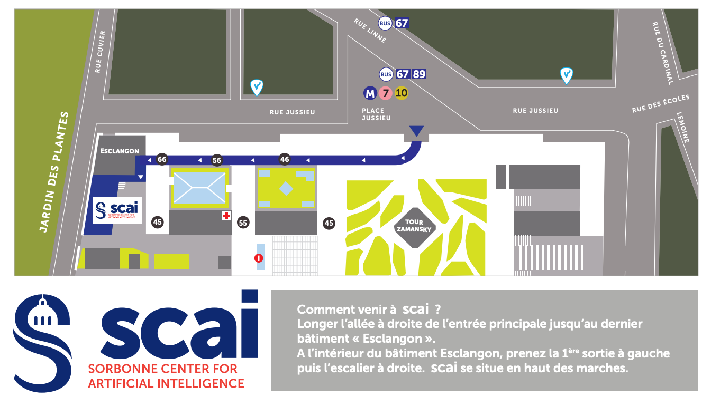

NewInML will be held at NeurIPS, Nov 28th 2022. We are updating the website frequently. Stay tuned! If you have any question, please contact us by: contactnewinml@gmail.com

# Mission

With the booming research in artificial intelligence, the community is welcoming every day many newcomers. A lack of mentoring and inclusive environment becomes gradually significant. Our goal is to welcome new researchers in the community and provide them with some guidance to contribute to Machine Learning research fully and effectively. 

# Program

**Session day: Nov 28th, 2022** This will be a whole day session. 

## NewInML in New Orleans

**Registration link** [https://forms.gle/ZQ1bEiwgEvpsByx26](https://forms.gle/ZQ1bEiwgEvpsByx26)

|**Time** (New Orleans)  | **Event**|
|---------------|--------------------------------------------------|
|09:00 - 10:00| **Keynote talk**: Yoshua Bengio (Mila & U. Montreal) |
|10:00 - 10:30| QA and break |
|10:30 - 11:30| **Ethics in AI**: Jean-Gabriel Ganascia (Sorbonne Université)|
|11:30 - 12:00| QA and break |
|12:00 - 13:00| Lunch |
|13:00 - 14:00| **Career talk**: Rex Ying (Yale University) |
|14:00 - 14:30| QA and break |
|14:30 - 15:30| **Writing session**: Reka Mihalka and Simon Milligan (ETH Zurich) [(necessary) Zoom Link](https://ethz.zoom.us/j/67774213023) |
|15:30 - 16:00| QA and break |
|16:00 - 17:00| **ML job negociation talk**: Nicole Bannon (Team Rora) |
|17:00 - 17:30| QA and break |

## NewInML in Paris

| **Time** (Paris) | **Event** |
|---------------| --------------------------- |
| 15:00 - 16:00 | Poster Session |
| 16:00 - 17:00 | **Keynote talk**: Yoshua Bengio (Mila & U. Montreal) |
| 17:00 - 17:30 | QA and break |
| 17:30 - 18:30 | **Ethics in AI**: Jean-Gabriel Ganascia (Sorbonne Université)|
| 18:30 - 19:30 | Poster Session |

**Coming to NewInML in Paris**

Address: 4 Pl. Jussieu, 75005 Paris (Sorbonne Center for Artificial Intelligence - SCAI)

# Speakers

* Title of the Presentation: **Ethics of AI and Large Scale ML — Beyond Rules and Regulations**
* Speaker: Jean-Gabriel Ganascia (Sorbonne University)
* Abstract of the Presentation: _For more than a lustrum now, numerous ethics committees wrote reports about ethics of AI and ML, and make advices about data privacy, fairness of algorithms, absence of bias, trustworthiness of AI systems etc. However, when pursuing a detailed examination, these more or less compulsory recommendations appear to be both contradictory and discussable. Our presentation will first give a look on the limitations of the many provisional regulations about AI and large scale ML that are under adoption in the EU and in many other places in the world. Then it will discuss the needs for robustness and evaluation of AI systems, especially of AI systems that are based on ML techniques. It will show the difficulties to make such evaluations relevant in many different fields, for instance in natural language generation where the notion of bias is so difficult to appreciate, and more generally in fields where there is no clear specification of what the AI system should be intended to do. It will end with some proposals for a design of AI systems that be neither regulatory nor normative but ethical._

# Organizers

- Zhen Xu (4Paradigm)
- Jie Fu (BAAI)
- Mélisande Teng (Mila)
- Alexandra Volokhova (Mila)
- Romain Egele (Argonne National Laboratory & Université Paris-Saclay)
- Eulalie Boucher (LERMA, Observatoire de Paris)
- Franck Bardol (Paris Machine Learning)
- Isabelle Guyon (University Paris-Saclay, ChaLearn)

# Sponsors

- Google
- 4Paradigm
- BAAI
- ChaLearn
- [LightOn](https://lighton.ai)

# NewInML in the past:

- [NeurIPS 2019](https://nehzux.github.io/NewInML2019/)
- [ICML 2020](https://nehzux.github.io/NewInML2020ICML/)
- [NeurIPS 2020](https://vanyacohen.github.io/NewInML)
- [NeurIPS 2021](https://sunhaozhe.github.io/NewInML2021_NeurIPS/)
- [ICML 2022](https://ablacan.github.io/NewInML2022_ICML/)
